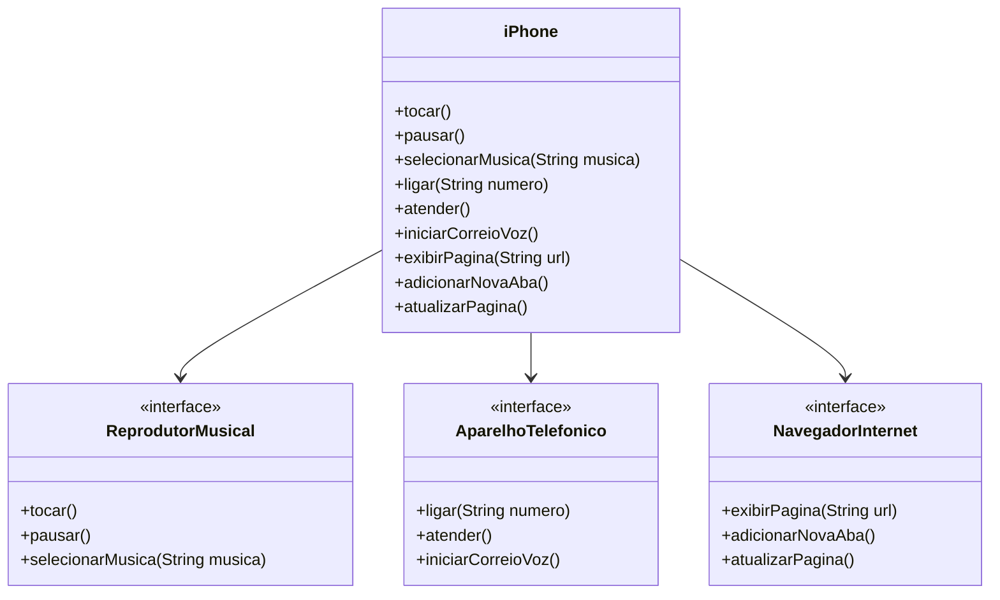

## POO - Desafio

### Modelagem e Diagramação de um Componente iPhone

Neste desafio, você será responsável por modelar e diagramar a representação UML do componente iPhone, abrangendo suas funcionalidades como Reprodutor Musical, Aparelho Telefônico e Navegador na Internet.

#### Contexto
Com base no vídeo de lançamento do iPhone de 2007 (link abaixo), você deve elaborar a diagramação das classes e interfaces utilizando uma ferramenta UML de sua preferência. Em seguida, implemente as classes e interfaces no formato de arquivos `.java`.

[Lançamento iPhone 2007](https://www.youtube.com/watch?v=9ou608QQRq8)
- Minutos relevantes: 00:15 até 00:55

#### Funcionalidades a Modelar
1. **Reprodutor Musical**
   - Métodos: `tocar()`, `pausar()`, `selecionarMusica(String musica)`
2. **Aparelho Telefônico**
   - Métodos: `ligar(String numero)`, `atender()`, `iniciarCorreioVoz()`
3. **Navegador na Internet**
   - Métodos: `exibirPagina(String url)`, `adicionarNovaAba()`, `atualizarPagina()`

### Objetivo
1. Criar um diagrama UML que represente as funcionalidades descritas acima.
2. Implementar as classes e interfaces correspondentes em Java (Opcional).

### Diagrama UML (Mermaid)


### Instruções
1. Assista ao vídeo do lançamento do iPhone para entender as funcionalidades principais.
2. Utilize uma ferramenta UML de sua preferência para criar o diagrama das classes e interfaces. Você pode utilizar o modelo acima (criado na sintaxe [Mermaid](https://mermaid.js.org/)), uma alternativa open-source e compatível com arquivos Markdown como este.
3. Opcionalmente, caso esteja cheio(a) de confiança, pode implementar as classes Java representadas em seu diagrama UML.
4. Submeta seu repositório GitHub conforme as orientações da plataforma DIO. Por exemplo:

```bash
https://github.com/glysns/trilha-java-basico/desafios/poo/README.md
```

---

## Conceitos de Orientação a Objetos (POO)

A Programação Orientada a Objetos possui quatro pilares principais:

### 1. Encapsulamento

É o princípio de esconder os detalhes internos de implementação de uma classe, expondo apenas o necessário por meio de métodos públicos. Isso protege os dados e facilita a manutenção.

**Exemplo:**
No código Java, os métodos `tocar()`, `pausar()` e `selecionarMusica(String musica)` são expostos pela interface `ReprodutorMusical`, mas a implementação interna está encapsulada na classe `iPhone`.

### 2. Herança

Permite que uma classe herde características (métodos e atributos) de outra. Em Java, isso é feito usando `extends` (para classes) ou `implements` (para interfaces).

**Exemplo:**
A classe `iPhone` implementa as interfaces `ReprodutorMusical`, `AparelhoTelefonico` e `NavegadorInternet`, herdando seus métodos.

### 3. Abstração

Consiste em expor apenas os comportamentos essenciais de um objeto, ocultando detalhes complexos. Interfaces e classes abstratas são exemplos de abstração.

**Exemplo:**
As interfaces `ReprodutorMusical`, `AparelhoTelefonico` e `NavegadorInternet` representam abstrações de funcionalidades do iPhone.

### 4. Polimorfismo

Permite que um mesmo método tenha comportamentos diferentes dependendo do objeto que o implementa. Pode ser de sobreposição (override) ou sobrecarga (overload).

**Exemplo:**
A classe `iPhone` implementa os métodos das interfaces, podendo ser usada como qualquer um dos tipos:

```java
ReprodutorMusical player = new iPhone();
player.tocar();

AparelhoTelefonico telefone = new iPhone();
telefone.ligar("123456");
```

Assim, o mesmo objeto pode assumir diferentes formas conforme o contexto.